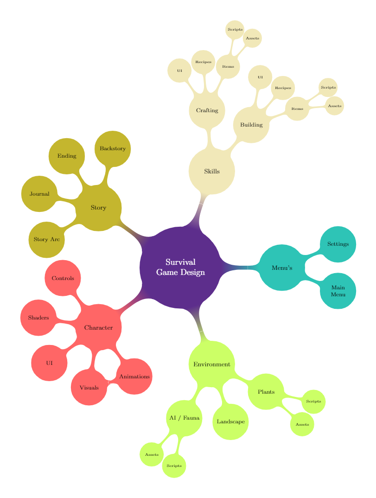

# Survival Game Project
A survival game focused on exploration and building, with a strong storyline, and expansive underwater / on land ecosystem.

## Table of Contents
1. [Team Members](https://github.com/sargasso-studios/general_testing#1-team-members)
2. [Getting Started](https://github.com/sargasso-studios/general_testing#2-getting-started)
3. [Style Guide](https://github.com/sargasso-studios/general_testing#3-style-guide)
	- [Naming](https://github.com/sargasso-studios/general_testing#31-naming)
	- [Language](https://github.com/sargasso-studios/general_testing#32-language)
	- [Declaration](https://github.com/sargasso-studios/general_testing#33-declaration)
	- [Spacing](https://github.com/sargasso-studios/general_testing#34-spacing)
	- [Commenting / Headers](https://github.com/sargasso-studios/general_testing#35-commenting--headers)
	- [Bracing](https://github.com/sargasso-studios/general_testing#36-bracing)
	- [Layout](https://github.com/sargasso-studios/general_testing#37-layout)
	- [Directory](https://github.com/sargasso-studios/general_testing#38-directory)
		- [File Structure](https://github.com/sargasso-studios/general_testing#381-file-structure)
		- [Files Types](https://github.com/sargasso-studios/general_testing#382-file-types)
4. [Design](https://github.com/sargasso-studios/survival#4-design)
	- [Character](https://github.com/sargasso-studios/survival#41-character)
		- [Controls](https://github.com/sargasso-studios/survival#411-controls)
		- [Shaders](https://github.com/sargasso-studios/survival#412-shaders)
		- [UI](https://github.com/sargasso-studios/survival#413-ui)
		- [Visuals / Animations](https://github.com/sargasso-studios/survival#414-visuals--animations)
	- [Environment](https://github.com/sargasso-studios/survival#42-environment)
		- [AI / Fauna](https://github.com/sargasso-studios/survival#421-ai--fauna)
		- [Landscape](https://github.com/sargasso-studios/survival#422-landscape)
		- [Plants](https://github.com/sargasso-studios/survival#423-plants)
	- [Menu's](https://github.com/sargasso-studios/survival#43-menus)
		- [Main Menu](https://github.com/sargasso-studios/survival#431-main-menu)
		- [Settings](https://github.com/sargasso-studios/survival#432-settings)
	- [Skills](https://github.com/sargasso-studios/survival#44-skills)
		- [Building / Construction](https://github.com/sargasso-studios/survival#441-building--construction)
		- [Crafting](https://github.com/sargasso-studios/survival#442-crafting)
	- [Story](https://github.com/sargasso-studios/survival#45-story)
		- [Backstory](https://github.com/sargasso-studios/survival#451-backstory)
		- [Ending](https://github.com/sargasso-studios/survival#452-ending)
		- [Journal](https://github.com/sargasso-studios/survival#453-journal)
		- [Story Arc](https://github.com/sargasso-studios/survival#454-story-arc)

## 1. Team Members
- Charlie Brown
- Chris Mimm
- Jack Thomas
- Nye Goodall
- Sadiq Adesanya

## 2. Getting Started
- Unity Version 2018.3.9 (found in 2018.x section of: https://unity3d.com/get-unity/download/archive)
- 3ds Max Version ...

## 3. Style Guide
This section is an outline of our preferred coding style, in order to improve readability/understandability, make sure that there is a clear structure to each script, and ensure a universal standard throughout all of the scripts.

### 3.1 Naming
- Use Camel Case for variables, and parameters
- Use Pascal Case for functions, properties, events, and classes
- Use Pascal Case for files, and directories
- Do not use prefixes (e.g. m_ for private variables)
- Do use 'I' prefix for interfaces

### 3.2 Language
- Always use US spellings
- The only exception is 'MonoBehaviour' as this is the name of the class

**Good:**
```cs
string color = "red";
```
**Bad:**
```cs
string colour = "red";
```

### 3.3 Declaration
- Use one line per variable declaration, do not have multiple variables declared on a single line

**Good:**
```cs
string variable1;
string variable2;
string variable3;
```
**Bad:**
```cs
string variable1, variable2, variable3;
```

### 3.4 Spacing
- Use a single space after the comma between function arguments (example 1)
- Do not use a space between the opening parenthesis (example 1)
- Do not use a space between the function name and opening parenthesis (example 1)
- Do not use spaces inside brackets (example 2)
- Use a single space before and after an operator (example 3)
```cs
// example 1:

Console.WriteLine(argument1, argument2, argument3);
```
```cs
// example 2:

x = dataArray[index];
```
```cs
// example 3:

if (x == y)

while (x == y)

Cnsole.WriteLine(x + y)
```

### 3.5 Commenting / Headers
- Double slash commenting (single line commenting) will be used rather than multi line commenting
- A space will be left after the double slash and before the comment (example 1)
- Comments should end with a period (example 1)
- Variables purposes should be clear from their names, although a comment may be attached if appropriate
- All functions should have a comment that clearly describes their purpose, intention, and approach
- Additional comments may be used elsewhere where appropriate
- Use Headers to separate sections, and therefore variables, to improve readability, and sort the variables into groups in the inspector

```cs
// example 1

// Comment Here.
```
```cs
// example 2

[Header("Title")]
```

### 3.6 Bracing
- Opening braces should be on the same like as the statements declaration
- Closing braces should be on their own line below the contents, unless there is an else statement which starts on the same line as the closing brace (examples seen below)
- All contents inside braces should be indented by 1 tab more than the braces themselves

```cs
static void Function(string parameter1, int parameter2) {
    // Contents
}
```

```cs
if(someExpression) {
    doSomething();
} else {
    doSomethingElse();
}
```


### 3.7 Layout
- Variables at top (public, then private)
- Functions next
- Code that runs at start
- Code that runs per frame
- Image to show this?

### 3.8 Directory

#### 3.8.1 File Structure

```
Assets
+---Art
|	+---Materials
|	+---Models
|	+---Textures
+---Audio
|	+---Music
|	+---Sound
+---Code
|	+---Scripts
|		+---Environment
|		+---Framework
|		+---Tools
|		+---UI
|	+---Shaders
+---Docs
|	+---Wiki
|	+---ConceptArt
|	+---Marketing
|	+---Readme
+---Level
|	+---Prefabs
|	+---Scenes
|	+---UI
+---Resources		# Configuration files, localization text, other user files
```

#### 3.8.2 File Types

| Files         | File Type     |
|:-------------:|:-------------:|
| Music         | .WAV          |
| Sound         | .OGG          |
| Models        | .FBX          |
| Textures      | .PNG          |

## 4. Design
Intro paragraph for the design section



### 4.1 Character
Intro to the Character design section.

#### 4.1.1 Controls
Prefabs of a simple character model (capsule) with functioning character controls

Inital design
- Basic WASD movement
- Ability to control the direction of the character with the mouse
- Add simple functions like crouch, jump, running

Further 
- Separating different controls into their own functions (e.g. crouching, jumping, running, etc.)
- Using Unity's Input Manager & built in multiplatform commands (e.g. 'Horizontal' rather than 'Mouse X')
- Implement swimming

#### 4.1.2 Shaders
- Shaders info

#### 4.1.3 UI
- UI info

#### 4.1.4 Visuals / Animations
- Visuals / Animations info

### 4.2 Environment
Intro to the Environment design section.

#### 4.2.1 AI / Fauna
A prototype of the ecosystem design.

Inital design
- Build system for zoning that populates a specific area with plant life taking in to account terrain.
- Expand zoning system to have plants instantiated in clusters with variables dictating available food.
- Build basic herbivore AI that paths around based on terrain, handles encounters with food,carnivores.
- Build basic carnivore AI that hunts herbivores when hungry, and otherwise patrols.

Further 
- Test build second species of herbivore with different behaviour (i.e. bottom feeders).
- Expand Herbivore AI to accommodate swarms (when >1 are in close proximity have them join together and consolidate logic).

#### 4.2.2 Landscape
- Landscape info

#### 4.2.3 Plants
- Plants info

### 4.3 Menu's
Intro to the Menu design section.

#### 4.3.1 Main Menu
- Main Menu info

#### 4.3.2 Settings
- Settings info

### 4.4 Skills
Intro to the Skills design section.

#### 4.4.1 Building / Construction
- Building / Contruction info

##### 4.4.1.1 UI
- Building / Construction UI

##### 4.4.1.2 Recipes / Items
- Table of Items, Recipes, Assets/visuals, Scripts (Items Purpose/Function)

	| Item          | Recipe        | Assets/Visuals| Scripts       |
	|:-------------:|:-------------:|:-------------:|:-------------:|
	| info          | info          | info          | info          |
	| info          | info          | info          | info          |
	| info          | info          | info          | info          |

#### 4.4.2 Crafting
- Crafting info

##### 4.4.2.1 UI
- Crafting UI

##### 4.4.2.2 Recipes / Items
- Table of Items, Recipes, Assets/visuals, Scripts (Items Purpose/Function)

	| Item          | Recipe        | Assets/Visuals| Scripts       |
	|:-------------:|:-------------:|:-------------:|:-------------:|
	| info          | info          | info          | info          |
	| info          | info          | info          | info          |
	| info          | info          | info          | info          |

### 4.5 Story
Intro to the Story section.

#### 4.5.1 Backstory
- Backstory info

#### 4.5.2 Ending
- Ending info

#### 4.5.3 Journal
- Journal info, ingame wiki with information on fauna / plants / environment / crafting / etc.

#### 4.5.4 Story Arc
- Story Arc info
