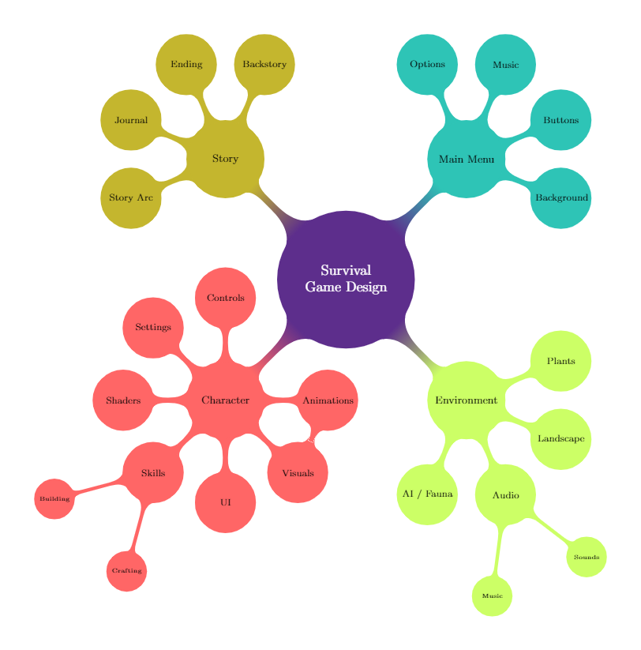

# Survival Game Project
A survival game focused on exploration and building, with a strong storyline, and expansive underwater / on land ecosystem.

## Table of Contents
1. [Team Members](https://github.com/sargasso-studios/general_testing#1-team-members)
2. [Getting Started](https://github.com/sargasso-studios/general_testing#2-getting-started)
3. [Methodology](https://github.com/sargasso-studios/general_testing#3-methodology)
4. [Style Guide](https://github.com/sargasso-studios/general_testing#4-style-guide)
	- [Naming](https://github.com/sargasso-studios/general_testing#41-naming)
	- [Language](https://github.com/sargasso-studios/general_testing#42-language)
	- [Declaration](https://github.com/sargasso-studios/general_testing#43-declaration)
	- [Spacing](https://github.com/sargasso-studios/general_testing#44-spacing)
	- [Commenting](https://github.com/sargasso-studios/general_testing#45-commenting)
	- [Bracing](https://github.com/sargasso-studios/general_testing#46-bracing)
	- [Layout](https://github.com/sargasso-studios/general_testing#47-layout)
	- [Directory](https://github.com/sargasso-studios/general_testing#48-directory)
		- [File Structure](https://github.com/sargasso-studios/general_testing#481-file-structure)
		- [Files Types](https://github.com/sargasso-studios/general_testing#482-file-types)
5. [Design](https://github.com/sargasso-studios/survival#5-design)
	- [Character](https://github.com/sargasso-studios/survival#51-character)
		- [Controls](https://github.com/sargasso-studios/survival#511-controls)
		- [Settings](https://github.com/sargasso-studios/survival#512-settings)
		- [Shaders](https://github.com/sargasso-studios/survival#513-shaders)
		- [Skills](https://github.com/sargasso-studios/survival#514-skills)
			- [Building](https://github.com/sargasso-studios/survival#5141-building)
			- [Crafting](https://github.com/sargasso-studios/survival#5142-crafting)
		- [UI](https://github.com/sargasso-studios/survival#515-ui)
		- [Visuals / Animations](https://github.com/sargasso-studios/survival#516-visuals--animations)
	- [Environment](https://github.com/sargasso-studios/survival#52-environment)
		- [AI / Fauna](https://github.com/sargasso-studios/survival#521-ai--fauna)
			- [Herbivores](https://github.com/sargasso-studios/survival#5211-herbivores)
				- [Small Herbivores](https://github.com/sargasso-studios/survival#52111-small-herbivores)
				- [Medium Herbivores](https://github.com/sargasso-studios/survival#52112-medium-herbivores)
				- [Large Herbivores](https://github.com/sargasso-studios/survival#52113-large-herbivores)
			- [Predators](https://github.com/sargasso-studios/survival#5212-predators)
				- [Small Predators](https://github.com/sargasso-studios/survival#52121-small-predators)
				- [Medium Predators](https://github.com/sargasso-studios/survival#52122-medium-predators)
				- [Large Predators](https://github.com/sargasso-studios/survival#52123-large-predators)
			- [Crustaceans](https://github.com/sargasso-studios/survival#5213-crustaceans)
				- [Small Crustaceans](https://github.com/sargasso-studios/survival#52131-small-crustaceans)
				- [Large Crustaceans](https://github.com/sargasso-studios/survival#52132-large-crustaceans)
		- [Audio](https://github.com/sargasso-studios/survival#522-audio)
			- [Music](https://github.com/sargasso-studios/survival#5221-music)
			- [Sounds](https://github.com/sargasso-studios/survival#5222-sounds)
		- [Landscape](https://github.com/sargasso-studios/survival#523-landscape)
		- [Plants](https://github.com/sargasso-studios/survival#524-plants)
	- [Main Menu](https://github.com/sargasso-studios/survival#53-main-menu)
		- [Background](https://github.com/sargasso-studios/survival#531-background)
		- [Buttons](https://github.com/sargasso-studios/survival#532-buttons)
		- [Music](https://github.com/sargasso-studios/survival#533-music)
		- [Options](https://github.com/sargasso-studios/survival#534-options)
	- [Story](https://github.com/sargasso-studios/survival#54-story)
		- [Backstory](https://github.com/sargasso-studios/survival#541-backstory)
		- [Ending](https://github.com/sargasso-studios/survival#542-ending)
		- [Journal](https://github.com/sargasso-studios/survival#543-journal)
		- [Story Arc](https://github.com/sargasso-studios/survival#544-story-arc)

## 1. Team Members
- Charlie Brown
- Chris Mimm
- Jack Thomas
- Nye Goodall
- Sadiq Adesanya

## 2. Getting Started
- Unity Version 2018.3.9 (found in 2018.x section of: https://unity3d.com/get-unity/download/archive)
- 3ds Max Version ...

## 3. Methodology
Info on Agile Methodology.


## 4. Style Guide
This section is an outline of our preferred coding style, in order to improve readability/understandability, make sure that there is a clear structure to each script, and ensure a universal standard throughout all of the scripts.

### 4.1 Naming
- Use Camel Case for variables and parameters
- Use Pascal Case for functions, properties, events, and classes
- Use Pascal Case for files, and directories
- Do not use prefixes (e.g. m_ for private variables)
- Do use 'I' prefix for interfaces

### 4.2 Language
- Always use US spellings
- The only exception is 'MonoBehaviour' as this is the name of the class

**Good:**
```cs
string color = "red";
```
**Bad:**
```cs
string colour = "red";
```

### 4.3 Declaration
- Use one line per variable declaration, do not have multiple variables declared on a single line

**Good:**
```cs
string variable1;
string variable2;
string variable3;
```
**Bad:**
```cs
string variable1, variable2, variable3;
```

### 4.4 Spacing
- Use a single space after the comma between function arguments (example 1)
- Do not use a space between the opening parenthesis (example 1)
- Do not use a space between the function name and opening parenthesis (example 1)
- Do not use spaces inside brackets (example 2)
- Use a single space before and after an operator (example 3)
```cs
// example 1:

Console.WriteLine(argument1, argument2, argument3);
```
```cs
// example 2:

x = dataArray[index];
```
```cs
// example 3:

if (x == y)

while (x == y)

Console.WriteLine(x + y)
```

### 4.5 Commenting
- Double slash commenting (single line commenting) will be used rather than multi-line commenting
- A space will be left after the double slash and before the comment (example 1)
- Comments should **not** end with a period (example 1)
- The first letter of comments should always be capitalised (example 1)
- Variables purposes should be clear from their names, although a comment may be attached if appropriate
- All functions should have a comment that clearly describes their purpose, intention, and approach
- Additional comments may be used elsewhere where appropriate

```cs
// example 1

// Comment Here
```

### 4.6 Bracing
- Opening braces should be on the same line as the statements declaration
- Closing braces should be on their own line below the contents, unless there is an else statement which starts on the same line as the closing brace (example seen below)
- All contents inside braces should be indented by 1 tab more than the braces themselves

```cs
static void Function(string parameter1, int parameter2) {
    // Contents
}
```

```cs
if(someExpression) {
    doSomething();
} else {
    doSomethingElse();
}
```


### 4.7 Layout
- The first lines should use **using** to import the namespaces that will be used in the script
- Next, declare the class of the script (only one class per script)
- Inside that class declare the variables for the script (public then private) using Headers to separate them into groups, which will be displayed in the inspector window in unity
- Next will be void Start which will contain all of the code that will be initialised when the script is run
- After that is void Update, which will run once per frame
- Finally is the list of functions, the format of which is demonstrated in the below example, which follow the same format as the class they are within
- Leave blank lines between sections (as seen in the example below), and do **not** leave any other blank lines
- All of the comments in the example below should be removed in the actual scripts

```cs
using UnityEngine;
using System.Collections;

public class ClassName : MonoBehaviour {
	[Header("Title to describe variable group")]
	public string stringName;
	private float floatName;

	[Header("Title to describe variable group")]
	public float floatName;
	private string stringName;

    // Use this for initialization
    void Start () {
    	// Code here
    }
    
    // Update is called once per frame
    void Update () {
    	// Code here
    }

    // Functions here
    public void FunctionName() {
    	[Header("Title to describe variable group")]
    	private string stringName;
    	private float floatName;

    	// Main Code here
    }
}
```

### 4.8 Directory
This section outlines the expections in terms of how we structure our files, and also the file types that should be used.

#### 4.8.1 File Structure

```
Assets
+---Art
|	+---Materials
|	+---Models
|	+---Textures
+---Audio
|	+---Music
|	+---Sound
+---Code
|	+---Scripts
|		+---Environment
|		+---Framework
|		+---Tools
|		+---UI
|	+---Shaders
+---Docs
|	+---Concept Art
|	+---Marketing
|	+---Readme
|	+---Wiki
+---Level
|	+---Prefabs
|	+---Scenes
|	+---UI
+---Resources		# Configuration files, localisation text, other user files
```

#### 4.8.2 File Types

| Files         | File Type     |
|:-------------:|:-------------:|
| Music         | .WAV          |
| Sound         | .OGG          |
| Models        | .FBX          |
| Textures      | .PNG          |

## 5. Design
This section is an overview of the design of the game followed by a highly descriptive breakdown of all the individual elements of the game. Below is a visual representation of the game design overview.



### 5.1 Character
Below is a breakdown of all of the aspects relating to the character, including all of the requisites for each element.

#### 5.1.1 Controls
**Requisites:**

- Basic WASD movement
- Camera control with mouse (capsule should rotate along x-axis with mouse, but not along y-axis)
- Crouching, jumping, and running (each of which should have their own function)
- Swimming (should detect one camera is below water surface, and controls should adjust appropriately to simulate swimming)
- Using Unity's Input Manager & built-in multiplatform commands (e.g. 'Horizontal' rather than 'Mouse X')

#### 5.1.2 Settings
- Settings info

#### 5.1.3 Shaders
- Shaders info

#### 5.1.4 Skills
- Skills info

##### 5.1.4.1 Building
- Building info (UI, Recipes, Items Scripts & Assets)

##### 5.1.4.2 Crafting
- Crafting info (UI, Recipes, Items Scripts & Assets)

#### 5.1.5 UI
- UI info

#### 5.1.6 Visuals / Animations
- Visuals / Animations info

### 5.2 Environment
Below is a breakdown of all of the aspects relating to the environment, including all of the requisites for each element, and also initial concept art.

#### 5.2.1 AI / Fauna
This section will outline the overview of all the types of Fauna in the game, their respective requisites, and behavioural patterns. Below is a tree diagram which illustrates how the different fauna are organised.


##### 5.2.1.1 Herbivores
Below the different variants of herbivorous fauna are broken down by their relative sizes and behavioural patterns.

###### 5.2.1.1.1 Small Herbivores
There are two types of small herbivorous fauna, shoalers, and scavengers, both of which have their own different behavioural patterns, as outlined below.

**Small Shoaling Herbivores:**


- Build basic herbivore AI that paths around based on terrain, handles encounters with food,carnivores.
- Expand Herbivore AI to accommodate swarms (when >1 are in close proximity have them join together and consolidate logic).

**Small Scavenging Herbivoes:**

- Test build second species of herbivore with different behaviour (i.e. bottom feeders).

###### 5.2.1.1.2 Medium Herbivores
There are two types of medium herbivorous fauna, shoalers, and scavengers, both of which have their own different behavioural patterns, as outlined below.

**Medium Shoaling Herbivores:**

**Medium Scavenging Herbivoes**

###### 5.2.1.1.3 Large Herbivores
There are two types of large herbivorous fauna, roamers, and scavengers, both of which have their own different behavioural patterns, as outlined below.

**Large Roaming Herbivores:**

**Large Scavenging Herbivoes:**

##### 5.2.1.2 Predators
Below the different variants of predatory fauna are broken down by their relative sizes and behavioural patterns.

###### 5.2.1.2.1 Small Predators
There is only one type of small predatory fauna, scavengers, which have their own behavioural pattern, as outlined below.

**Small Shoaling Preditors:**

###### 5.2.1.2.2 Medium Predators
There is only one type of medium predatory fauna, scavengers, which have their own behavioural pattern, as outlined below.

**Medium Roaming Preditors:**

- Build basic carnivore AI that hunts herbivores when hungry, and otherwise patrols.

###### 5.2.1.2.3 Large Predators
There is only one type of large predatory fauna, scavengers, which have their own behavioural pattern, as outlined below.

**Large Roaming Preditors:**

##### 5.2.1.3 Crustaceans
Below the different variants of crustaceans are broken down by their relative sizes.

###### 5.2.1.3.1 Small Crustaceans
info

###### 5.2.1.3.2 Large Crustaceans
info

#### 5.2.2 Audio
- Audio info

##### 5.2.2.1 Music
- Music info

[Ambient Music Track 1](/Assets/Audio/Music/SurvivalGameAmbientMusicTrack1.wav)

##### 5.2.2.2 Sounds
- Sounds info

#### 5.2.3 Landscape
- Landscape info

#### 5.2.4 Plants
**Requisites:**

- Build system for zoning that populates a specific area with plant life taking in to account terrain.
- Expand zoning system to have plants instantiated in clusters with variables dictating available food.

### 5.3 Main Menu
Below is a breakdown of all of the aspects relating to the main menu, including all of the requisites, and initial concept art.

#### 5.3.1 Background
- Background info

#### 5.3.2 Buttons
- Buttons info

#### 5.3.3 Music
- Music info

#### 5.3.4 Options
- Options info

### 5.4 Story
Below is a breakdown of all of the aspects relating to the story, including all of the major events, backstory, story chronology, and in game triggers for story advancement.

#### 5.4.1 Backstory
- Backstory info

#### 5.4.2 Ending
- Ending info

#### 5.4.3 Journal
- Journal info, ingame wiki with information on fauna / plants / environment / crafting / etc.

#### 5.4.4 Story Arc
- Story Arc info
